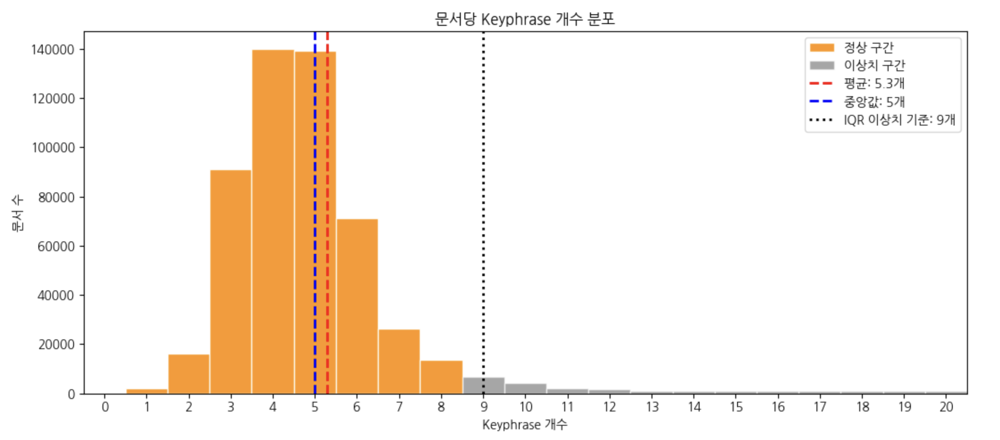
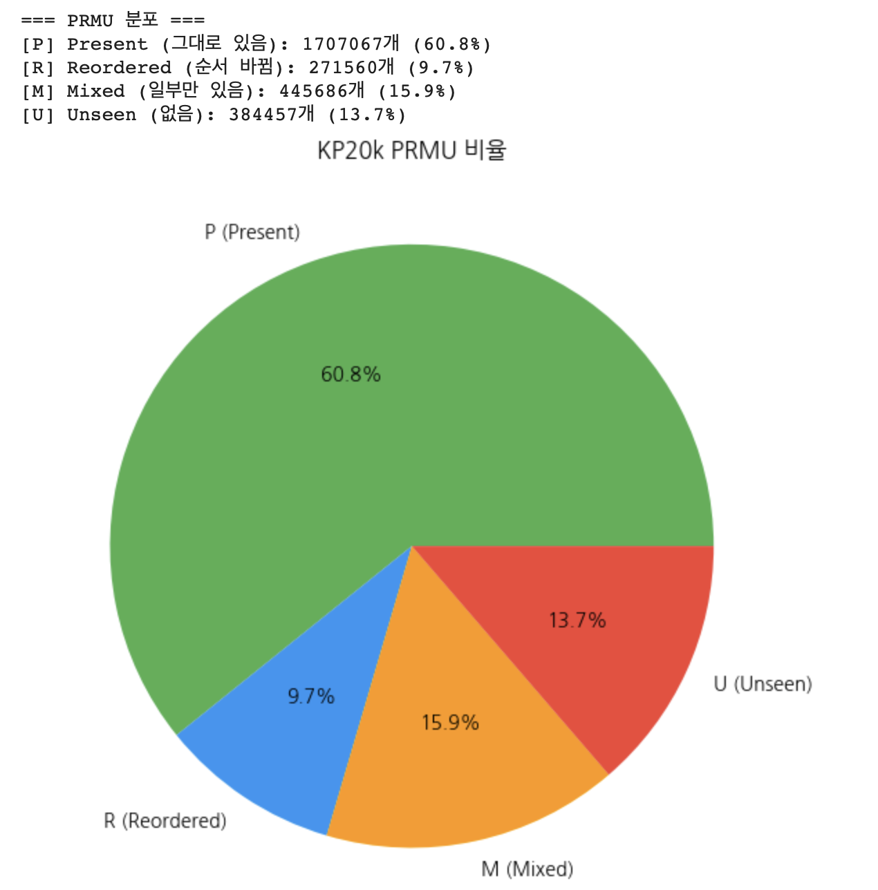
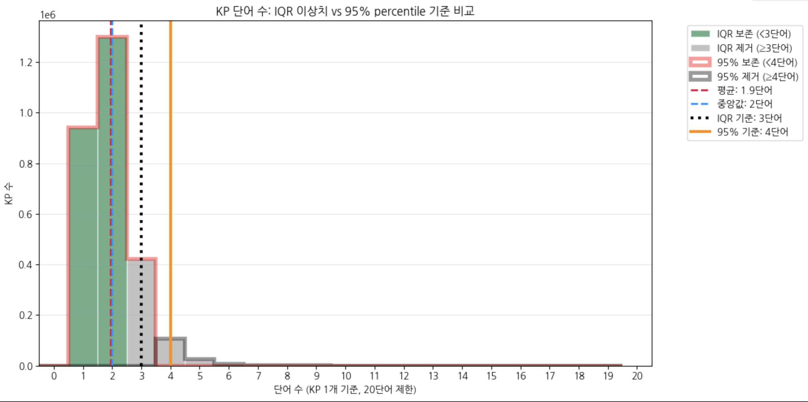
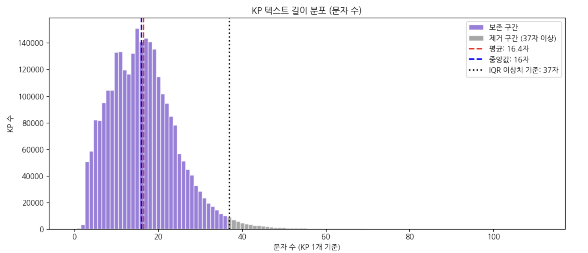

# 📊 KP20k Dataset EDA Report

## 목차
1. [데이터셋 구조](#1-데이터셋-구조)
2. [결측치 확인](#2-결측치-확인)
3. [Abstract 길이 분포](#3-abstract-길이-분포)
4. [문서당 Keyphrase 개수 분포](#4-문서당-keyphrase-개수-분포)
5. [PRMU 비율](#5-prmu-비율)
6. [KP 하나당 단어 수 분포](#6-kp-하나당-단어-수-분포)
7. [KP당 텍스트 길이 분포](#7-kp당-텍스트-길이-분포)
8. [이상치 KP의 PRMU 비율](#8-이상치-kp의-prmu-비율)

---

## 1. 데이터셋 구조

### 컬럼 목록
| 컬럼명 | 설명 |
|--------|------|
| `id` | 문서 고유 ID |
| `title` | 논문 제목 |
| `abstract` | 논문 초록 |
| `keyphrases` | 핵심 키프레이즈 목록 |
| `prmu` | 각 KP의 PRMU 태그 목록 |

### 샘플 데이터 (1개)

```json
{
  "title": "virtually enhancing the perception of user actions",
  "abstract": "This paper proposes using virtual reality to enhance the perception 
               of actions by distant users on a shared application ...",
  "keyphrases": ["animation", "avatars", "telepresence", 
                 "application sharing", "collaborative virtual environments"],
  "prmu": ["P", "P", "P", "R", "M"]
}
```

---

## 2. 결측치 확인

| 항목 | 결측 문서 수 |
|------|------------|
| Abstract 없는 문서 | **7개** |
| Keyphrase 없는 문서 | **0개** |

> ✅ Keyphrase는 전 문서에 존재하므로 학습 데이터로 바로 활용 가능합니다.

---

## 3. Abstract 길이 분포


| 통계 항목 | 값 |
|----------|-----|
| 평균 | 148 단어 |
| 중앙값 | 143 단어 |
| IQR 이상치 기준 | 316 단어 이상 |

> 대부분의 문서가 100~200단어 사이에 집중되어 있으며,  
> 316단어 이상은 이상치로 분류됩니다.

---

## 4. 문서당 Keyphrase 개수 분포



| 통계 항목 | 값 |
|----------|-----|
| 평균 | 5.3개 |
| 중앙값 | 5개 |
| IQR 이상치 기준 | 9개 이상 |

> 문서당 4~5개의 KP를 갖는 경우가 가장 많으며,  
> 9개 이상은 이상치로 간주합니다.

---

## 5. PRMU 비율



| 분류 | 설명 | 개수 | 비율 |
|------|------|------|------|
| **P** (Present) | KP가 본문에 그대로 존재 | 1,707,067개 | 60.8% |
| **R** (Reordered) | KP 단어가 순서만 바뀌어 존재 | 271,560개 | 9.7% |
| **M** (Mixed) | 일부 단어만 본문에 존재 | 445,686개 | 15.9% |
| **U** (Unseen) | 본문에 없는 새로운 KP | 384,457개 | 13.7% |

> 약 **39.2%의 KP가 본문에 완전히 없거나 부분적으로만 존재**하여,  
> 단순 추출(Extraction)만으로는 한계가 있고 **생성(Generation) 모델**이 필요합니다.

---

## 6. KP 하나당 단어 수 분포



| 통계 항목 | 값 |
|----------|-----|
| 전체 KP 수 | 2,808,770개 |
| 평균 | 1.9 단어 |
| 중앙값 | 2 단어 |
| IQR 이상치 기준 | 3 단어 이상 |
| 보존 KP | 2,242,289개 (79.8%) |
| 제거 KP | 566,481개 (20.2%) |

> 대부분의 KP는 **1~2단어**로 구성된 단어입니다.  
> 3단어 이상은 이상치로 분류되어 약 20%가 필터링됩니다.

---

## 7. KP당 텍스트 길이 분포 (문자 수)



| 통계 항목 | 값 |
|----------|-----|
| 평균 | 16.4 자 |
| 중앙값 | 16 자 |
| IQR 이상치 기준 | 37 자 이상 |

> KP 텍스트 길이는 **10~25자** 구간에 집중된 정규분포 형태를 보입니다.

---

## 8. 이상치 KP의 PRMU 비율
### 🔹 이상치 기준: 3단어 이상 (566,481개 / 20.2%)

| 유형 | 설명 | 전체 비율 | 이상치 비율 | 변화 |
|------|------|:---------:|:-----------:|:----:|
| **P** (Present) | 본문에 그대로 존재 | 60.8% | 47.9% | ▼ 감소 |
| **R** (Reordered) | 순서 바뀌어 존재 | 9.7% | 16.5% | ▲ 증가 |
| **M** (Mixed) | 일부만 존재 | 15.9% | 30.1% | ▲ 증가 |
| **U** (Unseen) | 본문에 없음 | 13.7% | 5.5% | ▼ 감소 |

### 🔹 이상치 기준: 4단어 이상 (145,142개 / 5.2%)

| 유형 | 설명 | 전체 비율 | 이상치 비율 | 변화 |
|------|------|:---------:|:-----------:|:----:|
| **P** (Present) | 본문에 그대로 존재 | 60.8% | 39.3% | ▼ 감소 |
| **R** (Reordered) | 순서 바뀌어 존재 | 9.7% | 18.9% | ▲ 증가 |
| **M** (Mixed) | 일부만 존재 | 15.9% | 38.3% | ▲ 증가 |
| **U** (Unseen) | 본문에 없음 | 13.7% | 3.5% | ▼ 감소 |

### 💡 해석
- 단어가 많은 KP일수록 **M(Mixed) 비율이 급격히 증가** (15.9% → 30.1% → 38.3%)
- **U(Unseen)은 오히려 감소** → 긴 KP일수록 본문에 단어가 부분적으로는 등장하는 경향
